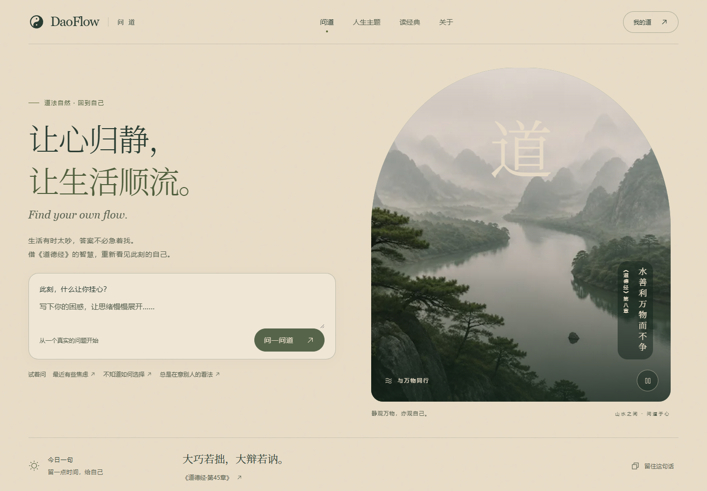
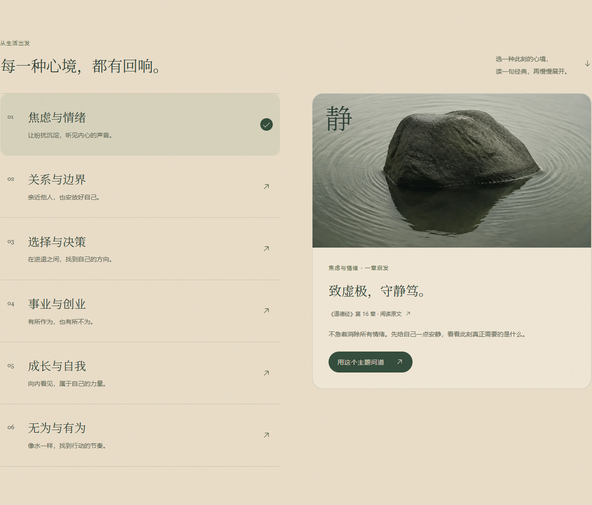
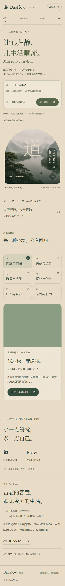

# DaoFlow 产品全景与返工思考资料
> 整理日期：2026-09-06
> 对象：当前本机 DaoFlow 网站。用途：产品复盘、重新定位、返工讨论与后续需求交接。
> 本文以当前源码、页面实现、历史项目说明和上轮测试记录为依据。明确区分已实现事实、未验证能力和产品建议；不把历史计划当作现状。本次仅整理资料，没有改动网站。

## 1. 先看产品全貌

**当前 DaoFlow 是一个“以生活困惑为入口，把用户带回《道德经》原文的 AI 辅助阅读与自我反思网站”。**

用户写一句困惑，系统匹配一章经典，展示原文、简短解读，以及可能出现的一句反思提问。用户可以继续阅读篇章，或在登录后回看近期记录。

它同时包含三种产品方向：
- 经典阅读：81 章原文与白话译文。
- 情境问道：围绕现实困惑匹配篇章与解读。
- 自我回顾：通过问道记录回望过去。

**目前尚未确定哪一种是产品的主价值。** 当前首页把“写下困惑”放在首位；历史文档却把它定义为“沉浸式数字阅读空间”。这不是简单的文案差异，会决定入口、内容、AI 角色、留存方式和收费逻辑。

| 基础信息 | 当前情况 |
|---|---|
| 产品名称 | DaoFlow |
| 中文名称 | 问道 |
| 文化内容范围 | 《道德经》81 章 |
| 当前主要操作 | 写下困惑 → 问一问道 |
| 核心结果 | 一章原文 + 解读 + 可选反思问题 |
| 网站形态 | 响应式 Web 网站，可在电脑、手机和桌面应用内浏览器访问 |
| 当前预览 | http://127.0.0.1:3100/ ，仅本机 |
| 用户系统 | 邮箱魔法链接登录，Supabase Auth |
| 历史记录 | 当前用户最近 5 条问道记录 |
| 原生客户端 | 本次未发现独立原生客户端实现 |
| 商业化 | 当前未发现付费、订阅、订单、套餐或计费入口 |
| 运营与用户证据 | 未取得真实活跃用户、留存、付费、访谈、转化或运行成本数据 |
| 完成度判断 | 具有完整前端流程的产品原型；尚不能仅凭界面与测试认定为生产成熟产品 |

## 2. 产品理念与品牌表达

### 原始理念
历史项目文档将产品描述为：
“DaoFlow（问道）是一个《道德经》沉浸式数字阅读空间。”
设计哲学是：“不是看见道，是看见自己站在道之中。”

这一理念强调体验与自我感受，目标并不是把经典堆成一个资料库，而是让阅读与当下生活发生联系。

### 当前版本的表达
- 主标题：让心归静，让生活顺流。
- 英文辅助句：Find your own flow.
- 核心说明：生活有时太吵，答案不必急着找。借《道德经》的智慧，重新看见此刻的自己。
- 品牌释义：“道”是万物自然的规律；“Flow”是顺应自己、从容前行的状态。
- 主题区：每一种心境，都有回响。
- 关于区：少一点纷扰，多一点自己。
- 结果页：换一个角度，看见自己。
- 阅读页：慢慢读，自有所得。
- 我的道：回望，也是前行。

### 产品希望建立的关系
系统提示词将 AI 定义为《道德经》的讲解者，要求简短解释、引导回到原文、不替用户做决定。由此可以归纳出当前产品意图：**提供一种理解问题的视角，把判断权留给用户。**

需要注意：提示词中的要求是设计意图，不等于程序已经保证每次输出都符合要求。当前校验主要检查数据格式。

### 当前价值主张中的假设
以下尚未获得用户研究验证：
1. 用户愿意在困惑时借助《道德经》理解自己。
2. 一章原文加简短解读，比通用聊天回答更有价值。
3. 平静的视觉氛围能帮助用户愿意表达。
4. 用户会为了回顾而保存问道记录。
5. 经典内容的可信度足以让用户接受 AI 的关联解释。

返工时，建议先验证这些假设，而不是直接扩大功能。

## 3. 可能的目标用户与使用场景

下表是根据现有内容推断的候选人群，不是已经验证的用户画像。当前没有依据指定年龄、职业、消费能力或市场规模。

| 候选用户 | 可能的需求 | 当前能提供什么 | 仍缺少什么 |
|---|---|---|---|
| 对经典感兴趣但读不进去的人 | 从现实问题理解古文 | 主题入口、原文和白话译文 | 明确学习路径、版本说明、难词注释 |
| 遇到选择或关系困惑的人 | 获得新的理解角度 | 输入困惑、篇章匹配、反思问题 | 有用性反馈、更多背景理解、回答质量证明 |
| 喜欢安静阅读和自我回顾的人 | 留下一小段独处时间 | 每日一句、阅读、近期记录 | 主动书写、阅读进度、长期回顾 |
| 只想得到直接答案的人 | 快速得到明确行动结论 | 当前主张可能与需求不匹配 | 需要决定是否服务这类需求 |

可能的使用时刻：
- 工作结束后，写下“我一直很焦虑，不知道在追什么”。
- 做选择之前，先阅读关于知足、知止或行动的一章。
- 没有明确问题，只想读一句话或读完一章。
- 过一段时间，回看自己曾经挂心的事情。

核心待选项是：产品更适合“问题出现时偶尔来一次”，还是“每天主动来一次”？两者的首页与留存设计不应混在一起判断。

## 4. 信息架构与页面地图

| 页面或区域 | 地址 | 作用 |
|---|---|---|
| 首页 | / | 品牌表达、提问入口、每日一句、人生主题、关于 |
| 人生主题 | /#themes | 首页内锚点，不是独立页面 |
| 关于 | /#about | 首页内品牌说明 |
| 问道结果 | /ask?q=… | 接收问题，发起请求，展示匹配原文与回答 |
| 经典阅读 | /chapters/1 至 /chapters/81 | 原文、译文、选章与翻页 |
| 我的道 | /my-dao | 登录、近期记录、退出 |
| 登录回调 | /auth/callback | 处理邮件登录返回 |
| 未找到页面 | 不存在的地址 | 提示返回首页 |

导航包括问道、人生主题、读经典、关于、我的道。首页锚点的导航选中状态跟随点击和 URL 哈希变化；当前不是基于滚动位置的全程自动跟踪。

## 5. 完整功能清单

### 5.1 首页提问
- 多行输入，最多 500 个 JavaScript 字符计数单位；普通中文通常一字一位，部分 emoji 会占多位。
- 空内容和纯空格不能提交。
- 输入后显示字数。
- 三个快捷问题：最近有些焦虑、不知道如何选择、总是在意别人的看法。
- 点击快捷问题会填写输入框并聚焦。
- 提交后打开结果页，以 URL 参数携带问题。
- 从结果页“返回问道”会把问题带回首页输入框。
- 当前没有通用的长期草稿保存；保留来自特定返回链接和 URL 参数。

### 5.2 山水主视觉
- 山水图片表达河流、自然与从容。
- 有缓慢呼吸动效，可以暂停或播放。
- 尊重系统“减少动态效果”偏好。
- 图上的“道”是装饰性品牌表达，不是额外功能入口。
- 当前没有环境音乐、语音朗读或冥想计时功能。

### 5.3 每日一句
- 展示句子及章节出处，可进入对应阅读页。
- 支持复制，失败时提示手动选择；首页复制反馈约 4 秒后复位。
- 接口失败时仍显示固定经典句子，标签切换为“经典一句”。
- 接口代码目前有 **29 条精选语句**，不是注释所写的 81 条。
- 选句按年度日期索引循环，不是根据个人情况推荐。
- 接口还返回建议问题，但当前首页使用固定的三个快捷问题，未使用这些动态建议。
- “每日”是否按预期跨天更新尚未验证；上轮构建把该路由列为静态生成，需要核查缓存与日期策略。
- 不包含推送、订阅邮件或打卡功能。

### 5.4 六个人生主题
电脑端左侧选择主题、右侧查看篇章预览；手机端主题为两列按钮，预览放在下方。
选中后更新文字、章节与启发，使用按钮把主题问题填入提问框。

| 主题 | 品牌字 | 固定预览 | 预填问题 |
|---|---|---|---|
| 焦虑与情绪 | 静 | 第 16 章：致虚极，守静笃。 | 最近总是很焦虑，停不下来 |
| 关系与边界 | 和 | 第 8 章：上善若水。 | 和某人的关系让我很困扰 |
| 选择与决策 | 择 | 第 44 章：知足不辱，知止不殆，可以长久。 | 面临一个重要的选择，不知道怎么办 |
| 事业与创业 | 行 | 第 64 章：千里之行，始于足下。 | 工作中找不到方向和意义 |
| 成长与自我 | 生 | 第 33 章：知人者智，自知者明。 | 感觉自己停滞不前，想成长 |
| 无为与有为 | 流 | 第 48 章：为学日益，为道日损。 | 不知道该努力还是该顺其自然 |

主题预览是固定编辑内容，不是现场生成的 AI 回答。提交时只传问题，没有传选中的主题或指定章节，因此最终 AI 匹配章节可能与预览不同。当前接口主题列表与首页主题内容分别维护，存在两处内容不同步的可能。

### 5.5 问道结果
展示内容：
1. 用户原问题。
2. 相关章号和原文。
3. AI 解读，或降级情况下的通用解读。
4. 可能出现的“留给自己的一个问题”。
5. 完整阅读本章、继续问道、复制回答。

其他状态：
- 等待期间有加载提示。
- 前端请求等待约 45 秒后停止，并提供重试或先读一章。
- 错误不会只留下空白页。
- 降级时明确说明未生成个性化回答。
- 复制内容包含问题、章号、原文、解读及反思问题。

**“继续问道”实际是回到首页重新提问，不是承接上下文的连续聊天。**
反思问题目前只是显示出来，没有填写自己的反思、追问或记录行动的入口。结果不是逐字流式输出，而是等待完整返回后展示。

### 5.6 经典阅读
- 覆盖 1 至 81 章。
- 显示原文与白话译文。
- 可切换“只读原文”与“原文与译文”。
- 下拉选择任意章，支持上一章、下一章。
- 第 1、81 章处理边界；无效章号提供错误提示。
- 远程章节读取失败或超时，使用项目内已有的章节数据。
- 当前没有全文搜索、注释体系、多个译本对照、朗读、笔记、进度或书签。
- 原文与译文的具体版本、译者及编辑来源未在当前页面明确呈现；需要单独核对。原文可公开使用并不自动说明现代译文或注释的使用条件。

### 5.7 我的道
未登录：
- 输入邮箱，发送登录链接，无密码登录。
- 提供发送中、已发送、错误、换邮箱状态。

已登录的代码流程：
- 展示账号邮箱。
- 查询当前用户最近 5 条记录，按创建时间倒序。
- 每条显示问题和日期，可展开查看解读和反思问题。
- 支持空记录提示、加载失败重试、再次问道、退出登录。

实际边界：
- 登录后的真实邮件链路和历史同步没有在上轮端到端测试中验证。
- 界面只展示 5 条，不代表数据库只保留 5 条。
- 没有分页、搜索、删除、导出、重命名或账户注销入口。
- 没有把匿名记录在登录后自动认领的实现。
- “留住每一次对话”的文案强于“只展示最近 5 条”的当前能力。

### 5.8 全站基础体验
- 统一导航、页脚和错误页。
- 电脑与手机响应式布局。
- 键盘焦点和跳到正文入口。
- 主题选中、阅读模式、记录展开使用可访问状态属性。
- 本地字体，减少依赖外部字体下载。
- 未完成全站无障碍认证，也未声称通过真实用户性能评估。

## 6. 当前的三条用户路径

### 路径 A：带着问题来
进入首页 → 输入或选择问题 → 提交 → 等待 → 阅读原文与解读 → 看反思问题 → 完整阅读或重新提问。

当前断点：读完反思问题以后，没有记录个人答案或继续深入的功能。

### 路径 B：暂时没有问题
进入首页 → 浏览每日一句或人生主题 → 进入篇章 → 阅读原文和译文 → 翻页或离开。

当前断点：缺少进度、收藏或下一次回来时的接续点。

### 路径 C：回看过去
进入我的道 → 邮箱登录 → 查看最近 5 条 → 展开回顾 → 再问一次。

当前断点：历史记录没有搜索和长期组织，也没有让用户标记“现在怎么看这件事”。

## 7. AI 到底做了什么

### 当前调用流程
问题 → Agnes → 失败时 DeepSeek → 再失败时本地关键词匹配 → 获取章号对应的原文 → 返回结果。

| 层级 | 代码中的配置 | 当前行为 |
|---|---|---|
| 主模型 | agnes-2.0-flash | 单次调用，约 8 秒超时配置 |
| 备用模型 | deepseek-chat | 主模型失败后调用，约 10 秒超时配置 |
| 本地保底 | 硬编码关键词映射 | 不调用模型，匹配章号与固定解读 |

这些是项目配置，不是对供应商当前可用性、价格或服务能力的外部核验。

### 输出约定
模型需要返回章号、解读和反思问题。提示词希望解读不超过 4 句，不替用户下决定。程序检查章号为 1–81 的整数、解读非空、反思问题为字符串。

### 重要实现差距
- **81 章全文没有真正放进模型上下文。** 当前提示词实际说明使用 AI 内置知识。
- 看似支持传入章节获取函数，但当前代码没有调用该函数取得全文，只替换了一句占位说明。
- 展示给用户的原文是模型选章之后从本地或远端取回的，因此“原文准确呈现”和“AI 选章有可靠依据”是两个独立问题。
- 格式检查没有验证解读是否忠实原文、是否适合用户处境、是否超过 4 句或是否作了强硬判断。
- 没有已建立的真实问题质量评测集或编辑审核流程。
- 当前没有向量检索、知识库检索流程、用户长期记忆或多轮上下文。

### 本地保底的限制
- 按关键词包含关系匹配，不理解完整语境。
- 多关键词优先找章节交集，否则取首个匹配候选。
- 没命中时默认第 1 章。
- 专门的固定解读只有第 1、33、44、64 章。
- 其他章节会返回提到“从第一章重新开始”的通用文字，可能与显示的章号不一致。
- 通用文字中出现“大道无形，生育天地”，没有在这一处提供出处；不应把它默认当作匹配的《道德经》原文。
- 本地降级没有反思问题。
- 降级原因再次转换时会丢失原始分类，可能最终显示或记录为 unknown。

因此当前的保底主要保证“有东西返回”，不能视为“内容效果等同于正常 AI 回答”。

## 8. 视觉设计系统与素材

### 风格方向
自然系、安静、东方经典的当代呈现。以沙色底和松苔绿建立整体一致性，用宋体标题、细分隔线、克制的圆角和山水意象表达“道”与“流”。

### 颜色角色
| 颜色 | 数值 | 用途 |
|---|---|---|
| 沙色 | #E8DCC7 | 页面背景、深色按钮上的文字 |
| 深绿 | #293C32 | 主文字、品牌 |
| 鼠尾草绿 | #8B9D83 | 辅助底色与自然层次 |
| 苔绿 | #606C38 | 原始强调色、部分装饰 |
| 深苔绿 | #4F5E3C | 优化后的小字号强调文字 |
| 次级文字 | #58614F | 说明、辅助内容 |
| 按钮深绿 | #354D3C | 主要操作 |

指定文字色与沙色的对比度：主文字约 8.67:1、次级文字约 4.79:1、深苔绿约 5.17:1。这是颜色组合计算，不是全站逐元素认证。

### 字体和版式
- 标题：本地 Noto Serif SC 轻宋体子集，约 442 KB。
- 界面正文：系统中文无衬线字体。
- 英文品牌和辅助句：Georgia 等衬线字体。
- 桌面首页左右分栏，宽屏容器上限 1680 像素。
- 主要移动断点为 760/761 像素；还针对窄桌面和较矮窗口调整字号与图片高度。
- 手机保留单列阅读和 16px 输入文字，主题为两列选择。
- 标题、正文、辅助说明使用不同层级，保留长中文换行能力。

### 图片资产
| 资产 | 用途 | 情况 |
|---|---|---|
| daoflow-valley.png | 首页山水、账户页及淡背景 | AI 生成，河流与山谷对应 DaoFlow |
| daoflow-still-water.png | 水石原图 | AI 生成，约 1.88 MB |
| daoflow-still-water.webp | 主题区实际使用 | 保持画面内容，预编码为约 100 KB |
| 本地字体与许可 | 中文标题 | 字体许可随项目保存 |
| 旧太极、水墨图、历史截图 | 早期设计资产 | 仓库仍保留，不代表当前首页仍使用 |

图片提供氛围和品牌记忆，不能代替产品功能说明或用户价值证明。

### 最近的视觉调整意图
主题区从六张视觉重量相近的卡片，改为主题选择与篇章预览；关于区用文字结构取代重复山水图片；提高辅助文字可读性，并完善焦点、选中和复制反馈。

当前尚无用户研究证明这种风格对目标人群更有效。返工可以保留内容层级规则，同时完全更换风格。

## 9. 内容、数据与技术结构

### 基础技术
Next.js 14.2.35、React 18、TypeScript、Tailwind CSS 3；Supabase 提供数据库与认证；OpenAI SDK 连接兼容接口；Phosphor 图标；仓库已有 Motion，首页主要使用 CSS 动效。

历史文档提及 Vercel，但本次仅确认本机运行，未核验公网部署、域名、证书或线上环境。

### 接口
| 接口 | 用途 |
|---|---|
| POST /api/ask | 校验问题、匹配与解读、尝试写入记录、返回原文 |
| GET /api/chapters/:id | 章节原文与白话译文 |
| GET /api/daily-quote | 日期选句与建议问题 |
| GET /api/themes | 六个主题元数据；当前首页没有使用它作为统一数据源 |
| GET /api/me/history | 登录用户最近 5 条记录 |

### 数据表设计
| 表 | 设计用途 | 当前使用情况 |
|---|---|---|
| chapters | 原文、译文、标签、预置解读 | 阅读会查询，也有本地 JSON |
| themes | 主题定义 | 当前接口与首页主要用硬编码 |
| daily_quotes | 日期与章号 | 当前接口自行按日期计算 |
| keyword_chapter_map | 关键词与章号 | 当前降级实际用代码内映射 |
| users | 用户资料 | 登录关联 |
| ask_sessions | 问题、解读、章号、反思、供应商、时间等 | 提问时尝试写入 |
| favorites | 章节收藏 | 有建表设计，没有已接通的收藏功能 |

数据库迁移文件说明的是计划中的结构与策略，不等于已核验远端数据库与其完全一致。

### 数据流与隐私现状
- 问题会传入服务端，并可能发送给主模型或备用模型供应商。
- 问题通过 q 参数出现在浏览器地址中，可能进入浏览历史、复制链接或服务器访问记录。
- 服务端尝试保存问题及回答，即使没有登录也会尝试匿名插入。
- 迁移里的用户记录策略只允许用户访问自己的记录。按该策略推断，匿名插入可能被拒绝；实际远端策略未核验。
- 未发现匿名记录登录后合并的实现。
- 界面没有完整的数据保存期限、删除、导出或同意流程说明。
- 没有确认真实的数据库留存配置、日志内容和第三方数据处理设置。

这些信息会直接影响“用户是否愿意讲真实困惑”，不是仅在上线最后补上的技术细节。

## 10. 当前发现的问题与返工影响

这些是本次阅读源码得到的记录，没有在本次修改。

| 事项 | 证据或状态 | 对产品的影响 |
|---|---|---|
| 阅读、问答、回顾三种定位并存 | 现有文档与入口实际差异 | 首页和迭代容易反复摇摆 |
| AI 未接入真实章节上下文 | 代码确认 | 无法把选章依据当作已解决 |
| 固定主题预览与最终选章可能不同 | 提交仅传问题 | 用户可能不理解为什么换章 |
| 反思问题没有后续输入 | 界面确认 | 核心体验在“看完”处结束 |
| 历史仅 5 条且无分页 | 接口确认 | 长期回顾承诺不足 |
| 跨天更新未验证 | 日期逻辑与静态构建记录 | “今日一句”可能与实际更新不符 |
| 保底解读不覆盖全部匹配章 | 代码确认 | 故障时内容可能失配 |
| 总响应时间并非稳定小于 20 秒 | 记录写入和认证仍被 await 等待，且无统一总时限 | 模型超时预算不能代表全流程等待 |
| 中间件注释与行为不符 | 匹配表达式未排除 api，认证调用会等待 | 阅读和提问仍可能受认证网络影响 |
| 输出只有格式校验 | 代码确认 | 产品语气、文本依据和有用性仍待评价 |
| 登录回调 next 未作同源约束 | 使用 new URL(next, origin)，绝对地址可覆盖 origin | 与注释“同源安全”不一致，上线前应处理 |
| 历史导入脚本内发现硬编码高权限数据库凭据 | 本次静态读取发现，本文不抄录值，也未使用 | 应检查传播范围并在服务端轮换；不要直接公开完整仓库 |
| 内容版本与译文来源未明确 | 当前页面及所核对资料未给出完整说明 | 经典产品的可信度与内容使用条件需要补齐 |
| 未见提问限流或用量控制 | 所检查的请求链路中未见 | 公开服务前需避免无约束调用成本 |
| 旧项目说明过时 | 阅读页仍写“待做”，实际上已有 | 下一轮设计应以当前源码快照为基线 |

这不是完整安全审计或性能审计；这里列的是已经看到、与产品返工有直接关系的事项。

## 11. 已验证、未验证、未实现

### 上轮已经通过的检查
- 生产构建与类型检查。
- 19 项原有单元测试。
- 50 项浏览器检查：主题状态、原文出处、复制、预填、问道错误重试、阅读、导航、键盘、长问题、404 等。
- 14 种视窗布局，宽度从 320 到 2560 像素。
- 新图片加载与最终裁切。
- 手机与窄桌面下的账户页、阅读页布局。

### 尚未验证的关键事项
- 主、备用模型在真实用户问题上的质量与当前可用性。
- 完整真实邮件登录、登录后历史写入与读取。
- 远端数据库策略和迁移状态。
- 日期跨天后的内容更新。
- 真实网络下的等待时间、并发、成本及稳定性。
- 用户是否认为回答有用、愿意回来或付费。
- 全站无障碍、正式性能指标与公开上线状态。

上轮问道成功、失败和重试用受控 API 数据验证，不能当成真实 AI 效果证明。

### 当前未接通或未实现
连续对话、长期记忆、收藏界面、阅读进度、笔记、反思填写、用户反馈、历史删除与导出、搜索、多个译本、语音、提醒、打卡、付费、运营后台、社区。不要把数据库字段、预留接口或历史计划写成已交付功能。

## 12. 返工时最值得先决定的产品问题

### 问题一：用户到底为什么打开它？
需要选一句最具体的答案，例如“我读不懂经典”“我遇到一件事，想换个视角”或“我想回顾自己”。不要同时把三种都放在第一位。

### 问题二：为什么不是直接问通用 AI？
目前可能的差异包括经典依据、克制的回答结构、阅读氛围与个人回顾。但这些更多是方向，仍需要通过真实比较证实。

一个简单的验证方式：让同一位用户分别体验 DaoFlow 和自己常用的工具，观察哪一部分值得保留，以及读完以后做了什么。不要只问“哪个好看”。

### 问题三：用户完成一次访问时，应该带走什么？
可选结果：
- 理解了某一段经典。
- 对自己的处境产生了新的认识。
- 写下一句属于自己的反思。
- 发现一件可以尝试的小行动。

当前产品主要交付前两者的内容形式，但没有记录用户实际获得什么。

### 问题四：用户下次为什么回来？
每日一句只是内容更新，不自动形成习惯；历史记录只是存储，不自动产生回顾价值。需要确认返回的理由是新困惑、学习进度，还是看自己的变化。

### 问题五：AI 应该承担多大角色？
可以是入口、翻译辅助、关联解释或后续追问。角色越宽，内容评估、等待时间、成本与数据处理要求越高。先决定用户价值，再决定是否扩大 AI 能力。

### 问题六：什么可以收费？
当前没有付费证据。先弄清用户愿意为可信的内容、长期回顾、学习路径还是更深入的解释付出代价；不要先用次数限制代替价值判断。

### 问题七：什么不做？
返工需要一份明确的舍弃清单。例如第一版暂不做社区、复杂会员、音频和多个经典合集，把资源留给一个能完成的体验。

## 13. 三种可供取舍的方向

以下为基于现有资产的讨论选项，不是市场结论，也不是已批准的新需求。

| 方向 | 主任务 | 首页重点 | 可保留资产 | 主要取舍 |
|---|---|---|---|---|
| 经典阅读 | 看懂并读下去 | 今日一章、进度、原文 | 81 章、阅读页、视觉语言 | AI 退居辅助，补内容版本与阅读组织 |
| 情境问道 | 围绕一件真实的事换角度理解 | 问题输入、可信示例 | 当前提问与选章流程 | 优先修正选章依据与结果价值 |
| 反思记录 | 看见自己如何变化 | 写下近况、回看过去 | 账户与记录基础 | 需要反思输入、长期历史和数据管理 |

我的判断：**当前已有资产最接近“情境问道”，但返工前最该验证的是“读完这一章和解读，用户是否真的获得新的理解”。** 如果答案是否定的，继续强化图片和动效难以解决主问题。

## 14. 最快、最稳、最省钱的下一步

工作量是小范围验证的估算，不是开发承诺；不包含招募等待与外部服务费用。不需要先换框架或购买新 SaaS。

| 方案 | 做什么 | 时间估算 | 维护成本 | 风险 |
|---|---|---|---|---|
| 最快 | 直接用当前网站观察 5 位候选用户完成一次真实任务，整理卡点 | 准备与复盘 0.5–1 个工作日，访谈另约时间 | 无新增代码维护 | 低；小样本只能发现线索 |
| 最稳 | 先选一个主任务，核对真实选章与阅读依据，再用少量案例验证完整流程 | 约 3–5 个工作日，范围以单一流程为限 | 低至中 | 中；核心价值尚未证实 |
| 最省钱 | 暂停视觉返工，用现有篇章和手工整理的结果比较三种定位 | 约 1 个工作日准备，验证时间另计 | 极低 | 低；不能证明自动化体验 |

顺序建议：明确一个主用户和主时刻 → 写清一次访问的结果 → 观察现有体验 → 决定保留与舍弃 → 再写新版本需求。

建议记录的观察问题：
- 用户能否在没有解释的情况下说出网站能帮什么？
- 输入前是否犹豫？犹豫是隐私、表达困难，还是不相信有用？
- 原文、解读、反思问题，哪一个被认真看了？
- 用户能否用自己的话说出获得的新理解？
- 用户有没有明确的下一次使用场景？

这些比先设一个没有基线的留存率或付费目标更适合当前阶段。

## 15. 返工讨论填写页

| 决策 | 你的新答案 |
|---|---|
| 我们只优先服务谁？ | 待填写 |
| 他在什么具体时刻打开？ | 待填写 |
| 一次使用结束要带走什么？ | 待填写 |
| 《道德经》在其中不可替代的价值是什么？ | 待填写 |
| AI 只负责哪一件事？ | 待填写 |
| 下次回来最自然的理由是什么？ | 待填写 |
| 第一版只保留哪三个功能？ | 待填写 |
| 现在明确不做什么？ | 待填写 |
| 哪些内容必须有出处或人工核对？ | 待填写 |
| 问题和记录怎么保存，用户怎么控制？ | 待填写 |
| 用什么真实行为判断有用？ | 待填写 |
| 什么证据会让我们放弃这个方向？ | 待填写 |

## 16. 资产、依据与交接

### 本机位置
- 网站项目：C:\Users\70719\Desktop\项目\daoflow\daoflow-app
- 整理资料与交付：C:\Users\70719\Documents\Codex\2026-09-05\qi\outputs
- 上次视觉调整前备份：C:\Users\70719\Documents\Codex\2026-09-05\qi\work\daoflow-before-polish\src
- 本文不包含环境变量值、API 密钥或真实用户记录。

### 事实依据
| 信息 | 核对位置 |
|---|---|
| 原始定位与历史计划 | PROJECT_CONTEXT.md |
| 首页、主题与文案 | src/app/page.tsx |
| 当前视觉与布局 | src/app/globals.css、src/app/layout.tsx |
| 导航与页脚 | src/components/NavBar.tsx、Footer.tsx |
| 结果页与前端错误状态 | src/app/ask/page.tsx |
| 阅读页 | src/app/chapters/[id]/page.tsx |
| 用户与记录页 | src/app/my-dao/page.tsx |
| AI 行为与边界 | src/lib/ai/askDao.ts、callModel.ts、parseStructuredResponse.ts |
| 接口与写入行为 | src/app/api 下各 route.ts |
| 登录与请求中间件 | src/app/auth/callback/route.ts、src/middleware.ts |
| 章节内容 | scripts/seed/chapters.json |
| 数据结构与策略设计 | supabase/migrations/001_initial_schema.sql |
| 上轮验证记录 | DaoFlow-polish-verification.json、DaoFlow-responsive-checks.json |
| 设计优化背景 | 用户提供的“调研前端高级感要素”会话正文、DaoFlow-高级感优化说明.md |

### 可直接带给下一轮讨论的一段背景
DaoFlow 当前是围绕《道德经》的响应式网站。用户可匿名写下最多 500 个字符的困惑，系统尝试用主备 AI 匹配一章并给出简短解读与反思问题，失败则用关键词和固定文字保底。网站另有六类主题、每日一句、81 章阅读、邮箱登录和最近 5 条记录。视觉采用沙色与深绿、宋体、AI 山水与水石图。当前问道是单次请求，没有多轮上下文；模型选章尚未真正读入项目里的全文；真实模型质量、登录后链路和产品价值未完成验证。下一轮应先选择“阅读、情境问道、反思记录”中的主方向，再决定哪些功能与视觉值得保留。

## 17. 当前页面快照

以下为上一轮最终版本截图，供返工对照；截图用于记录当前设计，不证明真实用户体验或商业价值。

### 桌面首页

### 人生主题区

### 手机完整页面

